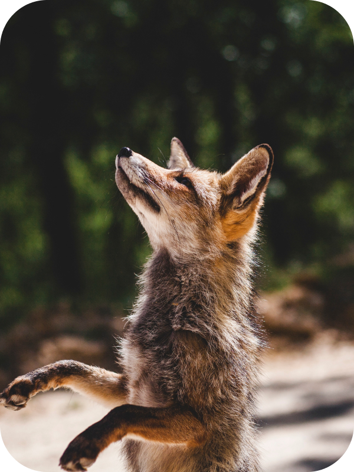

 

    
  </a>

  <h3 align="center">Algumas informações</h3>

  

    <a href="https://paulpbi.github.io/animais-fantasticos/" target="_blank">Site Finalizado</a>
    ·
    <a href="https://www.instagram.com/paulopbi_/" target="_blank">Instagram</a>
    ·
    <a href="https://www.linkedin.com/in/paulopbi/" target="_blank">Linkedin</a>
    ·
    <a href="https://github.com/Paulpbi" target="_blank">Github</a>
  

 

# Animais fantásticos

Animais fantásticos é um site que mostra um pouco da história dos animais.

## Sobre

O Foco dessa pagina é mostrar algumas das minhas habilidades no Frontend.  

A pagina possui alguns efeitos criados do 0 com javascript puro com bastante manipulação do DOM e uso de funções, site totalmente responsivo para vários tamanhos de telas e dispositivos, alguns dos efeitos são:

- Accordion
- Fade In
- Fade In no scroll
- Navegação por tabs

## O que eu aprendi neste projeto?

- Html
- Css
- Javascript
- Responsividade
- DOM
- Keyframes
- Semantica html

 

(<a href="#top">Voltar ao inicio</a>)

